# CognifyAI — System Architecture

CognifyAI is a multimodal adaptive learning platform. It ingests raw knowledge (PDFs, web data), dynamically generates personalized learning materials across Visual, Textual, and Auditory modalities, and orchestrates complex RAG workflows backed by a LangGraph agent engine.

---

## System Overview

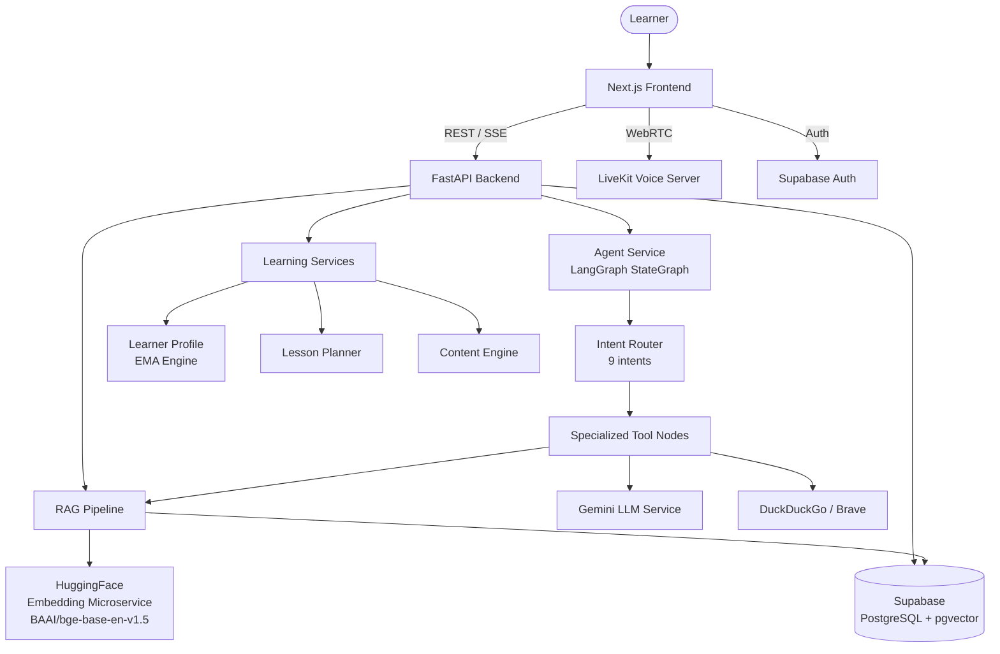

---

## 1. Enterprise RAG Module

**What it does:** Ingests documents, retrieves highly relevant context via hybrid search, and validates AI answers to prevent hallucinations.

### Contains

| File | Role |
|------|------|
| `services/chunking_service.py` | Hierarchical AST-based PDF chunking with breadcrumb enrichment; preserves heading parent-child relationships |
| `services/embedding_service.py` | Remote client to HuggingFace embedding microservice — no local torch/transformers |
| `services/rag_service.py` | Hybrid Retrieval (dense + sparse) merged via Reciprocal Rank Fusion (RRF) |
| `services/rerank_service.py` | Cross-attention reranking, filters chunks below 0.55 relevance threshold |
| `services/validation_service.py` | Self-correcting layer — cross-references LLM output against retrieved chunks to detect/fix hallucinations |
| `agents/chat_tools/retrieval.py` | Intent-aware top_k adjustment and document retrieval orchestration |
| `agents/chat_tools/query_planner.py` | Transforms user messages into optimised retrieval queries for doc + web search |
| `agents/note_composer_agent.py` | Consumes RAG context, emits structured multimodal study notes (text + diagrams + images) with citations |
| `agents/research_note_graph.py` | LangGraph topology: classifies topic sensitivity (medical/legal/finance) and triggers external web search when RAG confidence is low |
| `embedding-space/cognify-embedding/app.py` | Standalone HuggingFace Space — BAAI/bge-base-en-v1.5, 768-dim embeddings |

### Pipeline Flow

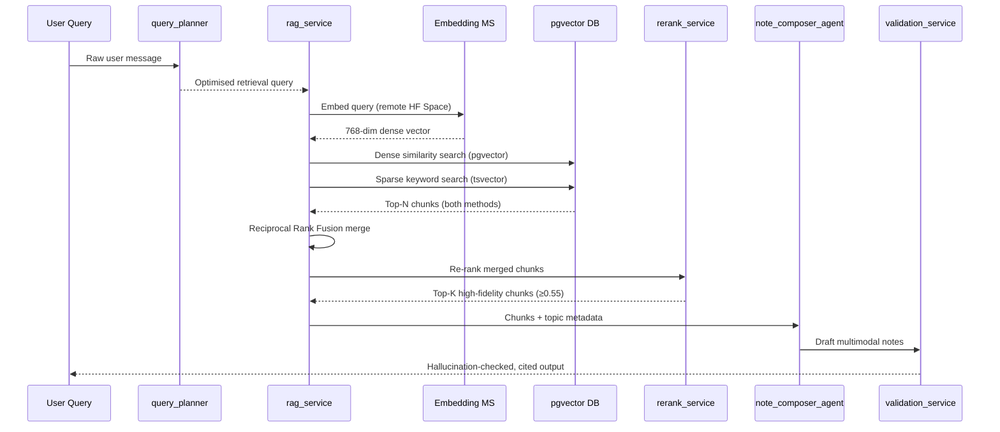

### Document Ingestion Flow

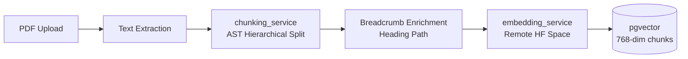

### Research Note Graph (Sensitivity-Aware)

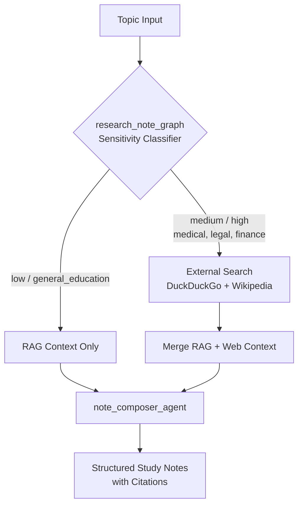

---

## 2. LangGraph Agent Orchestration Module

**What it does:** Routes every user message to the correct specialised agent pipeline via a LangGraph StateGraph with 9 classified intents.

### Contains

| File | Role |
|------|------|
| `services/agent_service.py` | Root LangGraph StateGraph — intent detection, node routing, state management |
| `agents/chat_tools/router.py` | Classifies user messages into 9 intents |
| `agents/chat_tools/normal.py` | Handles greetings, small-talk, app help — no RAG involved |
| `agents/chat_tools/tutoring.py` | Educational explanations with grounded RAG context |
| `agents/chat_tools/quiz.py` | Quiz generation with calibrated difficulty |
| `agents/chat_tools/visual.py` | Diagram and visual explanation generation |
| `agents/chat_tools/web_search.py` | DuckDuckGo external knowledge search |
| `agents/chat_tools/image_search.py` | Image retrieval for visual references |
| `agents/chat_tools/mcp.py` | MCP connectors — calendar, Drive, Docs, email |
| `agents/chat_tools/analysis.py` | Misconception analysis and targeted feedback on wrong quiz answers |

### Agent Routing Flow

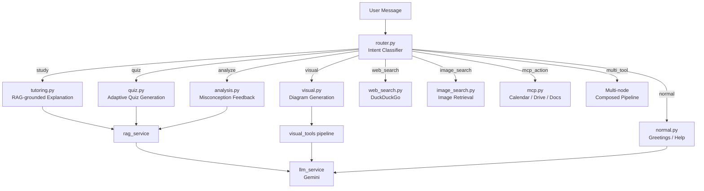

---

## 3. Voice & Auditory Support Module

**What it does:** Provides real-time conversational learning via WebRTC, text-to-speech for study notes, and low-latency voice chat with a streaming AI tutor.

### Contains

| File | Role |
|------|------|
| `api/endpoints/audio.py` | `/audio/query` and `/audio/query/stream` — voice-optimised endpoints with short, no-markdown, conversational responses |
| `core/config.py` | LiveKit URL, API key, and API secret configuration |
| `dashboard/auditory/page.tsx` | Frontend voice tutor UI — microphone input, real-time AI response, playback |
| Browser `window.speechSynthesis` | Native TTS — no backend ML models required; keeps backend serverless-compatible |
| LiveKit WebRTC | Ultra-low-latency real-time audio streaming infrastructure |

### Voice Architecture

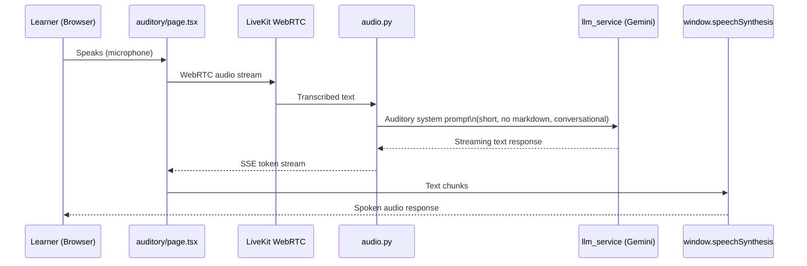

### Why No Backend TTS/STT Models

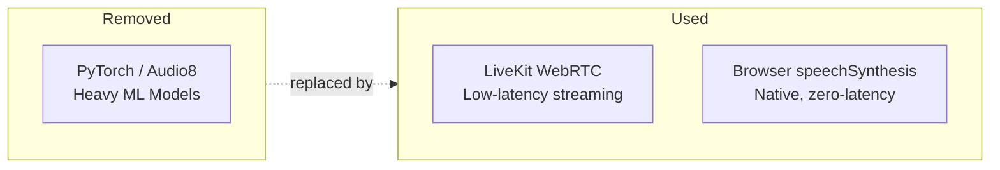

> **Design decision:** Heavy local ML models (torch, transformers) were removed to keep the backend serverless-friendly and horizontally scalable. The browser's native `speechSynthesis` API provides resilient, zero-dependency TTS.

---

## 4. Visual & Diagram Support Module

**What it does:** Translates text concepts into interactive visual structures — mind maps, flowcharts, and canvases — rendered live in the browser.

### Contains

| File | Role |
|------|------|
| `agents/visual_tools/planner.py` | Plans diagram structure and node hierarchy from a text description |
| `agents/visual_tools/validator.py` | Validates diagram AST; provides fallback plan if LLM output is malformed |
| `agents/visual_tools/layout.py` | Force-directed Dagre layout — positions nodes and edges on canvas |
| `agents/visual_tools/pipeline.py` | Orchestrates: plan → validate → layout in sequence |
| `agents/visual_tools/schemas.py` | Pydantic models for nodes, edges, and styles |
| `agents/visual_tools/icon_manifest.py` | Shape and icon definitions for rendering |
| `services/layout_solver.py` | Dagre graph layout solver (backend wrapper) |
| `api/endpoints/visual.py` | `/visual/explain` and `/visual/diagram` REST endpoints |
| `components/DiagramRenderer.tsx` | Mermaid.js React wrapper — renders AST as interactive canvas |
| `dashboard/visual/page.tsx` | Visual learner dashboard UI |

### Visual Generation Pipeline

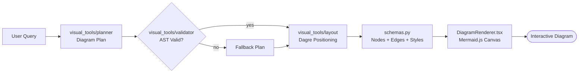

---

## 5. Adaptive Learning Services Module

**What it does:** Tracks each learner's evolving preferences across 10 dimensions, plans personalised lessons, and generates calibrated multimodal content.

### Contains

| File | Role |
|------|------|
| `services/learner_profile_service.py` | EMA-based dynamic learner model — 10 preference dimensions updated after each session |
| `services/lesson_planner_service.py` | Transforms learner profile into a concrete lesson plan (modality mix + difficulty + quiz count) |
| `services/content_engine_service.py` | Generates the full adaptive lesson payload: text, diagrams, examples, analogies, MCQs |
| `services/context_service.py` | Aggregates context from RAG output, learner history, and topic metadata |
| `api/endpoints/learning.py` | `/learning/profile`, `/learning/onboarding/*`, `/learning/lesson/*`, `/learning/generate-quiz`, `/learning/analyze-answer` |
| `agents/quiz_tools/validator.py` | Validates quiz question format and answer correctness |

### Adaptive Learning Loop

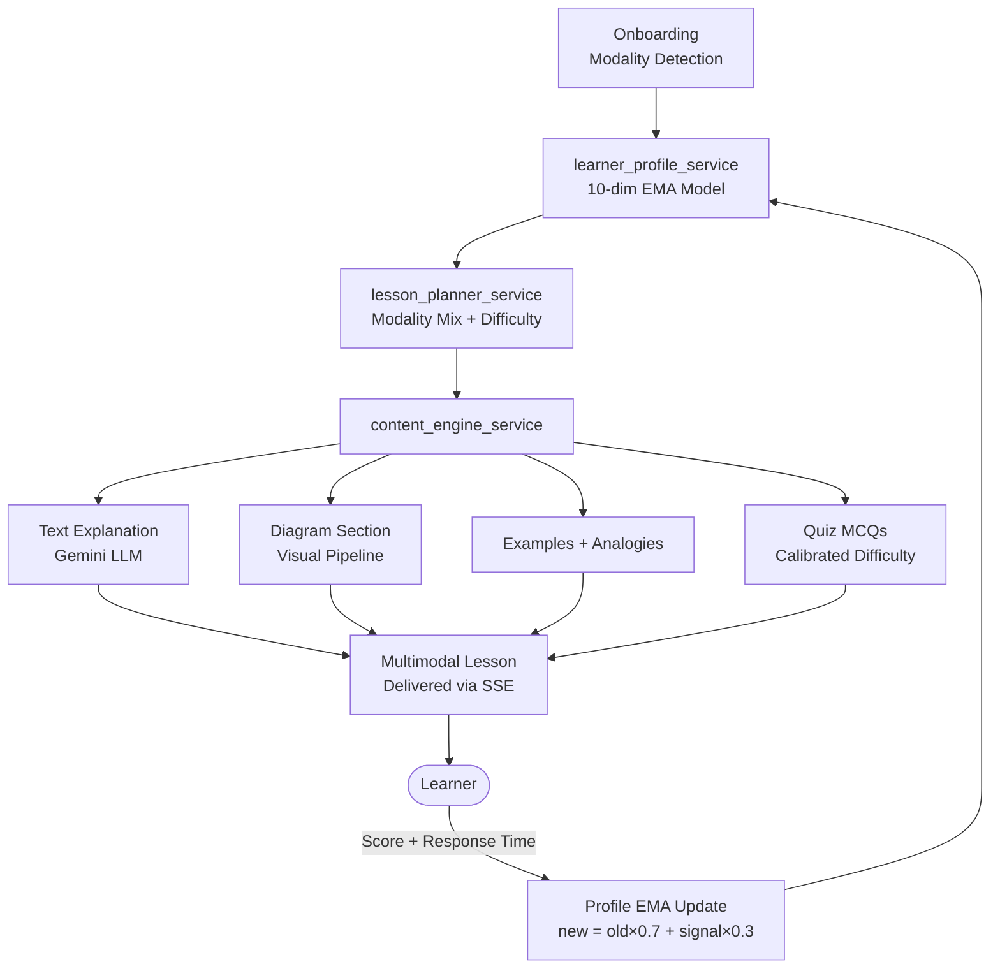

### Learner Profile Dimensions

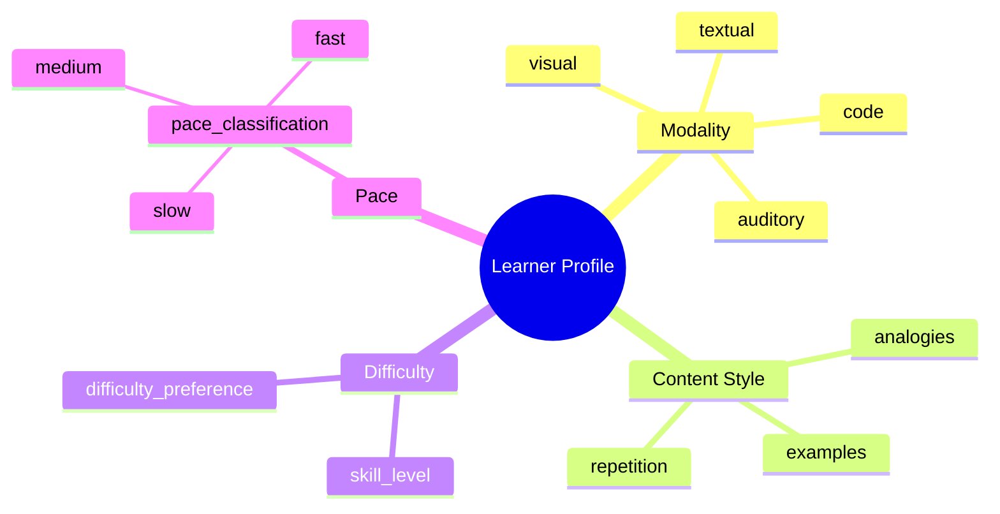

---

## 6. Frontend Application Modules

**What it does:** Next.js 15 app partitioned into distinct learning modalities, real-time streaming views, and utility pages.

### Page Map

```mermaid
flowchart TD
    Landing[app/page.tsx\nMarketing / Landing]
    Landing --> Login[auth/login\nSupabase Auth]
    Login --> DB[dashboard/layout.tsx\nSidebar + Providers]

    DB --> Learn[/learn\nRAG Notes + SSE Stream + Citations]
    DB --> Chat[/chat\nDocument Chat Interface]
    DB --> Visual[/visual\nDiagram Canvas]
    DB --> Auditory[/auditory\nVoice Tutor + WebRTC]
    DB --> Quiz[/quiz\nAdaptive Testing]
    DB --> Upload[/upload\nPDF Ingestion]
    DB --> Analytics[/analytics\nProgress + Modality Stats]
    DB --> Profile[/profile\nLearner Preferences]
    DB --> Onboarding[/onboarding\nModality Setup Flow]
    DB --> Search[/search\nGlobal Document Search]
```

### Data Flow: Learn Page (SSE Streaming)

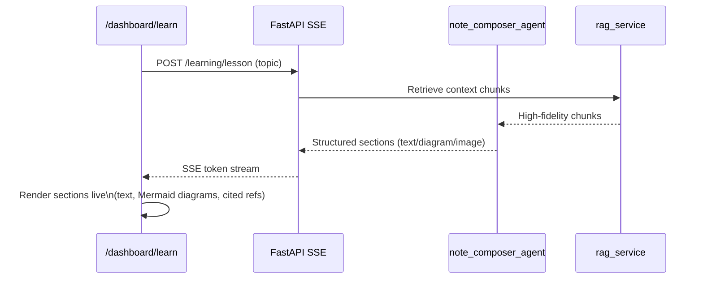

---

## 7. Backend Infrastructure & Deployment

**What it does:** Stateless FastAPI backend deployable to Vercel or AWS Lambda — no local ML models, all state in Supabase.

### Contains

| File | Role |
|------|------|
| `main.py` | FastAPI app init — CORS, router registration, `/health` endpoint |
| `core/config.py` | Pydantic Settings — Gemini, Supabase, LiveKit, HF embedding service, Brave API |
| `core/auth.py` | JWT validation and Supabase token → user ID extraction |
| `core/prompts.py` | Shared LLM system prompts across the platform |
| `db/database.py` | SQLAlchemy session management + Supabase connection |
| `models/db_models.py` | ORM models: Document (768-dim pgvector), User, QuizSession, QuizAttempt |
| `services/llm_service.py` | Gemini API wrapper — streaming, JSON parsing, multi-turn history |
| `Dockerfile` | Container image for FastAPI + uvicorn |
| `supabase_migration.sql` / `_v2.sql` | Database schema + pgvector extension setup |

### Infrastructure Stack

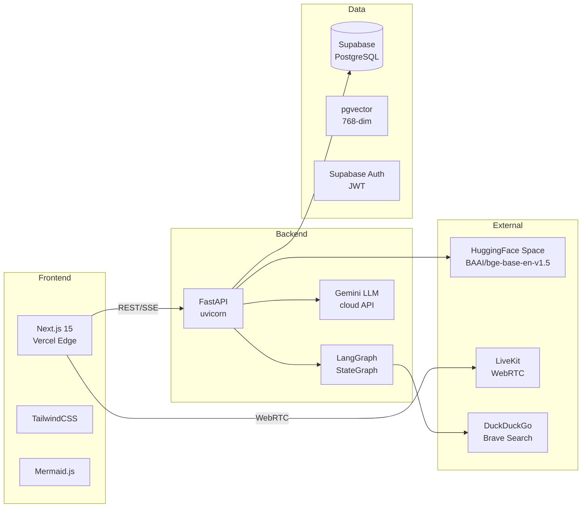

### Stateless Scaling Model

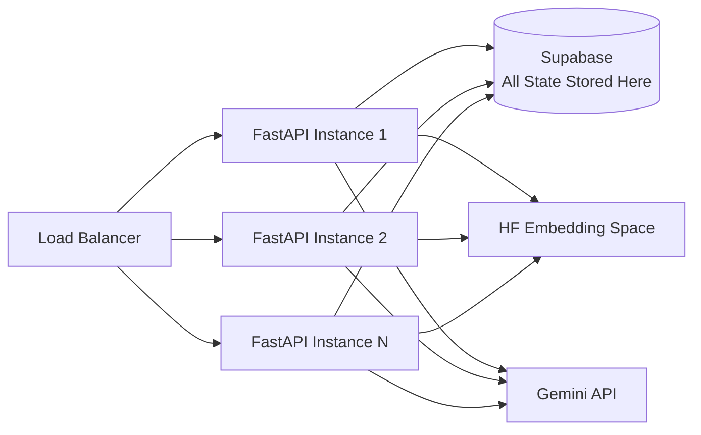

> All conversation history, document states, learner profiles, and vector embeddings live in Supabase. FastAPI instances carry zero local state, enabling seamless horizontal scaling.

---

## Full End-to-End Request Flow

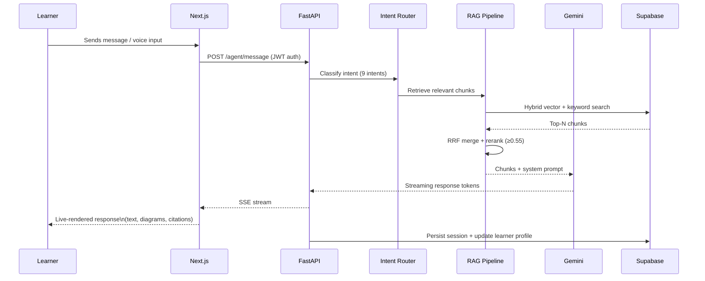
