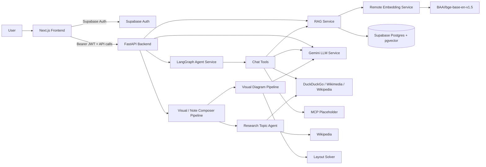
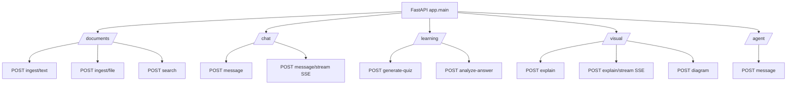
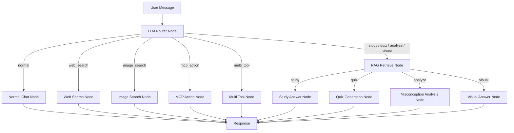
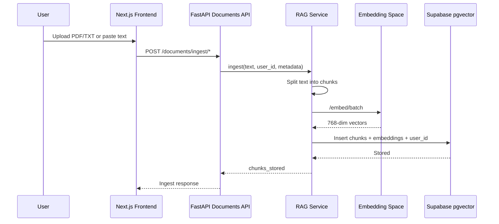
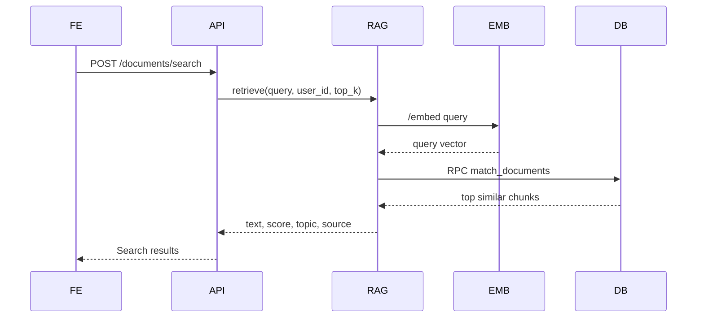
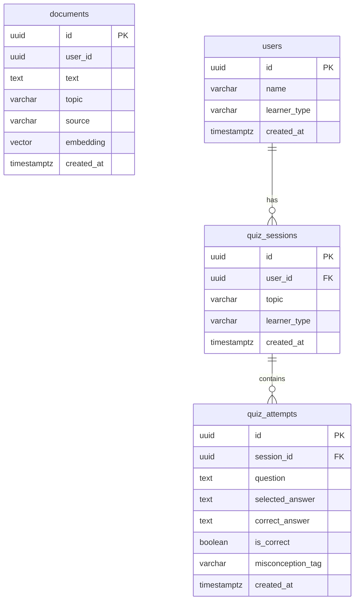
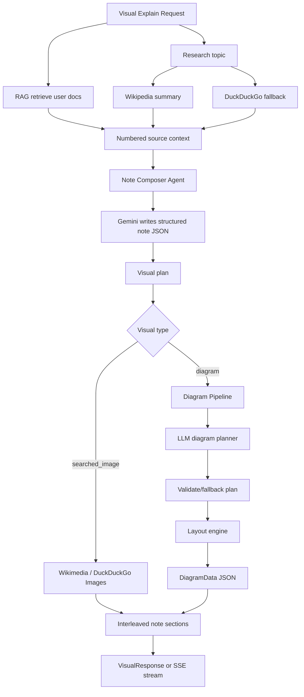
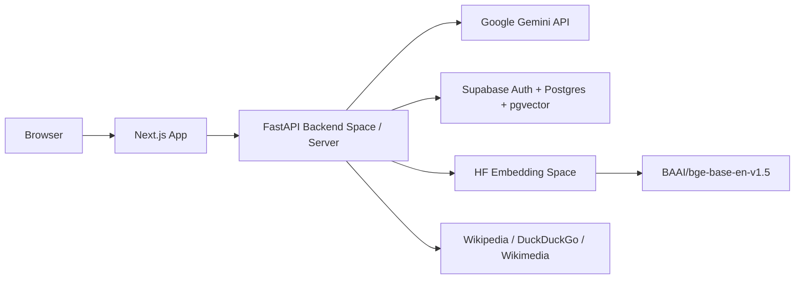

# CognifyAI Architecture

CognifyAI is a RAG-based adaptive learning platform. It combines a Next.js frontend, a FastAPI backend, Supabase authentication, Supabase/PostgreSQL with pgvector, a remote embedding service, Gemini-based LLM workflows, and a LangGraph tutor agent.

## High-Level Architecture



## Main Components

| Layer | Technology | Role |
|---|---|---|
| Frontend | Next.js 16, React 19, TypeScript, Tailwind | Dashboard UI, chat, uploads, quiz, visual explanations |
| Auth | Supabase Auth | Login/session handling; frontend sends access token to backend |
| Backend API | FastAPI | REST + SSE API for documents, chat, learning, visual explanations |
| Agent Orchestration | LangGraph | Routes chat requests into study, quiz, analyze, visual, web/image search, MCP placeholder |
| LLM | Gemini API | Routing, chat, quiz generation, misconception analysis, note writing, diagram planning |
| RAG | Supabase + pgvector | Stores document chunks and performs semantic search |
| Embeddings | Hugging Face Space microservice | Remote `BAAI/bge-base-en-v1.5` embeddings |
| Voice / Auditory | LiveKit Cloud / `livekit-api` | Real-time WebRTC room token issuance & audio tutor room |
| External Search | DuckDuckGo, Wikimedia Commons, Wikipedia | Web/image/research enrichment |
| MCP | Placeholder backend node | Intent exists, but no real MCP connector adapter is wired yet |

## Important Files

| Area | File |
|---|---|
| Backend entry | `backend/app/main.py` |
| Agent graph | `backend/app/services/agent_service.py` |
| RAG service | `backend/app/services/rag_service.py` |
| Embedding client | `backend/app/services/embedding_service.py` |
| LLM service | `backend/app/services/llm_service.py` |
| Database schema | `backend/supabase_migration.sql` |
| Frontend API client | `frontend/src/lib/api.ts` |
| Frontend Supabase client | `frontend/src/lib/supabase/client.ts` |
| Embedding microservice | `embedding-space/cognify-embedding/app.py` |

## Backend API Surface



## Agent Workflow

The backend agent is implemented in `backend/app/services/agent_service.py`. It uses LangGraph when available, and has a fallback imperative runner if LangGraph is not installed.



Agent intents:

- `normal`
- `study`
- `quiz`
- `analyze`
- `visual`
- `web_search`
- `image_search`
- `mcp_action`
- `multi_tool`

The `mcp_action` route exists, but `backend/app/agents/chat_tools/mcp.py` currently returns a setup-pending response. There is no live MCP connector adapter wired into the FastAPI backend yet.

## RAG / Document Workflow

### Ingestion



### Semantic Search



## Database Model

The Supabase migration is defined in `backend/supabase_migration.sql`.



The key database function is `match_documents(...)`, which performs cosine similarity search using pgvector and filters by `user_id`.

## Visual Explanation Workflow



## Embedding Microservice

The embedding service is a separate FastAPI app under `embedding-space/cognify-embedding/app.py`.

It loads:

```text
BAAI/bge-base-en-v1.5
```

Endpoints:

- `GET /health`
- `POST /embed`
- `POST /embed/batch`

The main backend does not load `torch`, `transformers`, or `sentence-transformers` directly. It calls the remote embedding service through `EMBEDDING_SERVICE_URL`.

## Agent Tools

| Tool | File | What it does |
|---|---|---|
| Router | `backend/app/agents/chat_tools/router.py` | Uses Gemini to classify user intent |
| Retrieval | `backend/app/agents/chat_tools/retrieval.py` | Pulls user-scoped RAG context |
| Normal chat | `backend/app/agents/chat_tools/normal.py` | General conversation |
| Tutoring/study | `backend/app/agents/chat_tools/tutoring.py` | RAG-grounded explanation |
| Quiz | `backend/app/agents/chat_tools/quiz.py` | Generates MCQs |
| Analysis | `backend/app/agents/chat_tools/analysis.py` | Misconception feedback |
| Visual | `backend/app/agents/chat_tools/visual.py` | Diagram/visual response |
| Web search | `backend/app/agents/chat_tools/web_search.py` | DuckDuckGo text search |
| Image search | `backend/app/agents/chat_tools/image_search.py` | DuckDuckGo + Wikimedia images |
| MCP | `backend/app/agents/chat_tools/mcp.py` | Placeholder only; no live connector adapter yet |

## Deployment Shape



## Summary

CognifyAI is structured as a full-stack AI learning platform. The frontend authenticates users with Supabase and sends bearer-token API requests to FastAPI. The backend validates Supabase JWTs, retrieves or stores user-scoped learning documents, calls a remote embedding service for vector representations, searches Supabase pgvector data, and uses Gemini for chat, routing, quiz generation, misconception analysis, visual-note composition, and diagram planning.

The strongest implemented workflows are:

- Document ingestion and semantic search
- RAG-grounded chat
- Adaptive quiz generation
- Misconception analysis
- Visual note generation with diagrams/images
- Web and image search enrichment

MCP support is represented architecturally, but it is currently a placeholder and needs a backend connector adapter before it can call real private tools.
