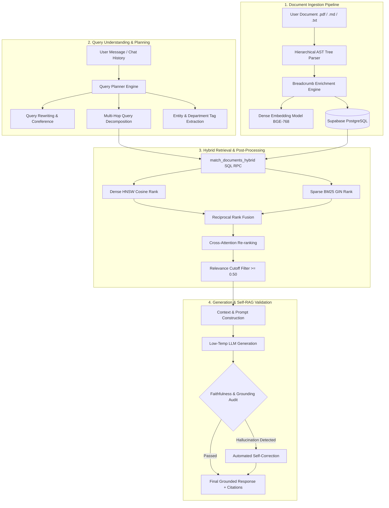

# 📘 Enterprise Production RAG: Complete Learning & Architecture Guide

Welcome to the **CognifyAI Enterprise Production RAG** architectural study guide. This document explains every design decision, algorithmic strategy, data structure, and code implementation built into the system so you can master and extend production-grade Retrieval-Augmented Generation.

---

## 📑 Table of Contents
1. [Why Naive RAG Fails vs. Enterprise RAG](#1-why-naive-rag-fails-vs-enterprise-rag)
2. [End-to-End System Architecture](#2-end-to-end-system-architecture)
3. [Phase 1: Ingestion & Document Enrichment](#3-phase-1-ingestion--document-enrichment)
   * [1.1 Hierarchical AST Document Chunking](#11-hierarchical-ast-document-chunking)
   * [1.2 Contextual Breadcrumb Enrichment](#12-contextual-breadcrumb-enrichment)
   * [1.3 Small-to-Big Parent Context Storage](#13-small-to-big-parent-context-storage)
4. [Phase 2: Database Schema & Dual Indexing](#4-phase-2-database-schema--dual-indexing)
   * [2.1 HNSW Vector Indexing (pgvector)](#21-hnsw-vector-indexing-pgvector)
   * [2.2 TSVector Full-Text Search (GIN Index / BM25)](#22-tsvector-full-text-search-gin-index--bm25)
   * [2.3 Multi-Tenant RBAC Security Filtering](#23-multi-tenant-rbac-security-filtering)
   * [2.4 Reciprocal Rank Fusion (RRF)](#24-reciprocal-rank-fusion-rrf)
5. [Phase 3: Query Intelligence & Decomposition](#5-phase-3-query-intelligence--decomposition)
   * [3.1 Query Understanding & Filter Extraction](#31-query-understanding--filter-extraction)
   * [3.2 Multi-Query Rewriting](#32-multi-query-rewriting)
   * [3.3 Query Decomposition](#33-query-decomposition)
6. [Phase 4: Post-Retrieval Refinement](#6-phase-4-post-retrieval-refinement)
   * [4.1 Cross-Attention Re-ranking](#41-cross-attention-re-ranking)
   * [4.2 Relevance Filtering & Noise Cutoff](#42-relevance-filtering--noise-cutoff)
   * [4.3 Context Construction & Token Budgeting](#43-context-construction--token-budgeting)
   * [4.4 Grounded Prompt Construction](#44-grounded-prompt-construction)
7. [Phase 5: Generation & Truth Validation (Self-RAG)](#7-phase-5-generation--truth-validation-self-rag)
   * [5.1 Low-Temperature Deterministic Generation](#51-low-temperature-deterministic-generation)
   * [5.2 Grounding & Faithfulness Validation](#52-grounding--faithfulness-validation)
   * [5.3 Automated Hallucination Self-Correction](#53-automated-hallucination-self-correction)
8. [Codebase Map & File References](#8-codebase-map--file-references)
9. [Hands-On Verification Examples](#9-hands-on-verification-examples)

---

## 1. Why Naive RAG Fails vs. Enterprise RAG

| Feature / Challenge | Naive Prototype RAG | Enterprise Production RAG (CognifyAI) |
| :--- | :--- | :--- |
| **Chunking** | Blind character or recursive token splitting (`chunk_size=500`). Breaks sentences and drops headers. | **Hierarchical AST Splitting**: Preserves Chapter ➔ Section ➔ Subsection ➔ Paragraph trees. |
| **Chunk Context** | "Chunk amnesia": Isolated chunk has no context about what document or chapter it belongs to. | **Contextual Breadcrumb Enrichment**: Injects `[Doc > Section]:` breadcrumbs into text before embedding. |
| **Retrieval Strategy** | Vector-only (Dense search). Misses exact product codes, acronyms, or specific keywords. | **Hybrid Search**: Combines Dense (HNSW pgvector) + Sparse (BM25 TSVector) with Reciprocal Rank Fusion (RRF). |
| **Security / RBAC** | No filtering or in-memory filtering (prone to data leaks). | **Database-Level RBAC**: Security (`user_id`, `department`, `permissions`) enforced in SQL `WHERE` clauses. |
| **Query Handling** | Passes raw user prompt directly into vector search. | **Query Understanding & Decomposition**: Resolves pronouns, extracts temporal filters, and splits multi-hop questions. |
| **Post-Retrieval** | Dumps raw top-k chunks directly into the LLM prompt. | **Re-ranking & Relevance Filtering**: Cross-attention scoring removes irrelevant noise below threshold (`< 0.50`). |
| **Context Assembly** | Stuffs chunks blindly, often exceeding token limits. | **Small-to-Big Context**: Retrieves small vectors for precision, injects larger parent sections for rich LLM context. |
| **Hallucination Check** | None. Assumes LLM answered factually. | **Self-RAG Validation**: Audits facts and citations against source context with automated self-correction. |

---

## 2. End-to-End System Architecture



---

## 3. Phase 1: Ingestion & Document Enrichment

*Implemented in:* `backend/app/services/chunking_service.py` & `backend/app/services/rag_service.py`

### 1.1 Hierarchical AST Document Chunking
Rather than cutting text every 500 characters, the document is parsed into an Abstract Syntax Tree (AST) following heading hierarchy:
* **Level 1 (`# Title`):** Represents high-level document or chapter.
* **Level 2 (`## Section`):** Represents functional modules or domains.
* **Level 3 (`### Subsection`):** Represents specific policies or guidelines.
* **Leaf nodes:** Individual coherent paragraphs.

### 1.2 Contextual Breadcrumb Enrichment
When a paragraph says: *"Employees receive 14 days of annual leave."*, an isolated vector model has no idea which company, department, or contract type this applies to.

We enrich the text before embedding:
```
HR Policy 2024 > Full-time Benefits > Leave Entitlements:
Employees receive 14 days of annual leave.
```
**Why this matters:** The vector representation now retains global document semantics without mutating the raw text presentation.

### 1.3 Small-to-Big Parent Context Storage
* **Problem:** Small chunks embed better because vectors capture specific semantics. However, LLMs generate better answers when they see surrounding context.
* **Solution:** We embed the small chunk, but store `parent_text` (the entire containing section). During retrieval, the fine-grained vector matches the search, but we expand the context sent to the LLM to include the parent section.

---

## 4. Phase 2: Database Schema & Dual Indexing

*Implemented in:* `backend/supabase_migration.sql`

```sql
-- Schema with HNSW vector + TSVector Full-Text search + RBAC columns
CREATE TABLE IF NOT EXISTS documents (
    id             UUID PRIMARY KEY DEFAULT gen_random_uuid(),
    user_id        UUID,                          -- User ownership
    text           TEXT NOT NULL,                 -- Raw chunk
    enriched_text  TEXT,                          -- Breadcrumb enriched
    parent_id      UUID,                          -- Parent section ID
    parent_text    TEXT,                          -- Surrounding parent text
    doc_title      VARCHAR(512),
    section_title  VARCHAR(512),
    topic          VARCHAR(255),
    source         VARCHAR(512),
    department     VARCHAR(100),                  -- RBAC: e.g. 'engineering', 'hr'
    author         VARCHAR(255),
    entities       TEXT[],                        -- Extracted tags
    permissions    TEXT[] DEFAULT ARRAY['public'],-- RBAC: ['public', 'admin']
    embedding      VECTOR(768),                   -- BGE Base Embedding
    fts            TSVECTOR GENERATED ALWAYS AS ( -- BM25 Keyword Search
                     to_tsvector('english', coalesce(doc_title, '') || ' ' || coalesce(section_title, '') || ' ' || coalesce(text, ''))
                   ) STORED,
    created_at     TIMESTAMPTZ DEFAULT NOW()
);
```

### 2.1 HNSW Vector Indexing (pgvector)
Hierarchical Navigable Small World (HNSW) creates a multi-layered geometric graph over embeddings. It replaces IVFFlat because:
1. It does not require periodic re-training or re-indexing when new documents are added.
2. It offers higher recall (>98%) at sub-millisecond query latencies.

### 2.2 TSVector Full-Text Search (GIN Index / BM25)
Vectors fail at exact keyword queries (e.g. error codes `ERR-504`, acronyms `EBITDA`, product numbers). PostgreSQL's `tsvector` with a Generalized Inverted Index (GIN) provides BM25-equivalent sparse keyword search.

### 2.3 Multi-Tenant RBAC Security Filtering
Security filtering is executed in SQL inside `match_documents_hybrid`:
```sql
WHERE 
    (p_user_id IS NULL OR d.user_id = p_user_id)
    AND (p_department IS NULL OR d.department IS NULL OR d.department = p_department)
    AND (p_permissions IS NULL OR d.permissions && p_permissions OR 'public' = ANY(d.permissions))
```
This guarantees that users can never retrieve documents outside their authorized department or permissions.

### 2.4 Reciprocal Rank Fusion (RRF)
Combines the rank positions of Dense and Sparse searches without needing normalized scores:
$$\text{RRF Score}(d) = \frac{1}{k + \text{rank}_{\text{dense}}(d)} + \frac{1}{k + \text{rank}_{\text{sparse}}(d)}$$
where $k = 60$ is a smoothing constant.

---

## 5. Phase 3: Query Intelligence & Decomposition

*Implemented in:* `backend/app/agents/chat_tools/query_planner.py`

### 3.1 Query Understanding
Analyzes the user's natural language input along with conversation history to extract:
* **Entities:** Specific names, products, or technologies.
* **Temporal Filters:** Time ranges (e.g. `Q1 2024`, `annual`).
* **Department Tags:** Automatically inferred organizational context.

### 3.2 Multi-Query Rewriting
Resolves pronouns and ambiguous references:
* *User input:* "What did we decide about its cost in the last review?"
* *Rewritten:* "AWS infrastructure cost optimization decision meeting notes"

### 3.3 Query Decomposition
Complex comparative or multi-hop questions cannot be answered in a single vector search.
* *User input:* "Compare AWS vs Azure costs in Q1 and explain why AWS was selected."
* *Decomposed Sub-queries:*
  1. `AWS cloud infrastructure costs Q1`
  2. `Azure cloud infrastructure costs Q1`
  3. `Decision rationale selecting AWS over Azure`

---

## 6. Phase 4: Post-Retrieval Refinement

*Implemented in:* `backend/app/services/rerank_service.py` & `backend/app/services/context_service.py`

### 4.1 Cross-Attention Re-ranking
Vector embeddings compute cosine similarity independently. A re-ranker evaluates the **joint cross-attention** $(\text{Query} \times \text{Passage})$ to calculate true factual relevance on a scale of `0.00` to `1.00`.

### 4.2 Relevance Filtering & Noise Cutoff
Even after top-k retrieval, chunks scoring below the minimum relevance threshold (`score < 0.50`) are discarded. This prevents off-topic passages from contaminating the prompt.

### 4.3 Context Construction
* **Deduplication:** Removes duplicate content retrieved across sub-queries.
* **Hierarchy Preservation:** Formats citations with full breadcrumb titles.
* **Token Budget Guard:** Enforces character/token limits to prevent context overflow.

### 4.4 Grounded Prompt Construction
Formats the prompt with strict system instructions:
```
--- EVIDENCE [1] ---
Source: HR Policy > Leave Entitlements
Relevance: 0.95
Content: Employees receive 14 days of paid annual leave.

---

USER QUESTION: How many days of annual leave do employees receive?
Provide a grounded, cited answer using ONLY the evidence above. Cite inline as [1], [2].
```

---

## 7. Phase 5: Generation & Truth Validation (Self-RAG)

*Implemented in:* `backend/app/services/validation_service.py` & `backend/app/services/llm_service.py`

### 5.1 Low-Temperature Deterministic Generation
We invoke the LLM with `temperature = 0.2` to ensure high factual precision and suppress creative hallucinations.

### 5.2 Grounding & Faithfulness Validation (Self-RAG)
Before any answer is returned to the user, an automated Truth Auditor inspects:
1. Is every factual claim in the response supported by the provided evidence?
2. Are inline citations (`[1]`, `[2]`) valid and referencing existing evidence blocks?
3. Does the answer make ungrounded assertions?

### 5.3 Automated Hallucination Self-Correction
If a hallucination is detected (e.g. claiming *60 days* instead of *30 days*):
1. The auditor generates structured feedback listing the hallucinated claims.
2. An automated correction agent rewrites the response to strictly conform to the source evidence.
3. If no evidence exists, the system safely triggers an honest refusal:
   > *"Based on your uploaded documents, I do not have enough relevant information to answer this question."*

---

## 8. Codebase Map & File References

| File Path | Primary Responsibility | Key Functions / Classes |
| :--- | :--- | :--- |
| `backend/supabase_migration.sql` | Database schema, HNSW + GIN indexes, RBAC, RRF hybrid RPC | `match_documents_hybrid`, `match_documents` |
| `backend/app/services/chunking_service.py` | AST hierarchical parsing & breadcrumb enrichment | `hierarchical_split`, `_build_breadcrumb` |
| `backend/app/services/embedding_service.py` | Passage & query dense vector embedding | `embed_passage`, `embed_query`, `embed_batch` |
| `backend/app/services/rag_service.py` | Ingestion orchestrator & hybrid retrieval coordinator | `RAGService.ingest`, `RAGService.retrieve` |
| `backend/app/agents/chat_tools/query_planner.py` | Query understanding, rewriting, and multi-hop decomposition | `plan_enterprise_query`, `plan_query` |
| `backend/app/services/rerank_service.py` | Cross-attention scoring & relevance cutoff filtering | `RerankService.rerank_and_filter` |
| `backend/app/services/context_service.py` | Context deduplication, Small-to-Big assembly, prompt building | `ContextService.construct_context`, `build_grounded_prompt` |
| `backend/app/services/validation_service.py` | Faithfulness auditor & hallucination self-correction | `ValidationService.validate_answer`, `_self_correct` |
| `backend/app/services/llm_service.py` | End-to-end grounded RAG execution & Gemini integration | `LLMService.grounded_rag_answer` |
| `backend/app/agents/chat_tools/retrieval.py` | Multi-query parallel retrieval agent tool | `retrieve_documents` |
| `backend/app/agents/chat_tools/tutoring.py` | Chat integration routing to grounded RAG | `answer_study_question` |
| `backend/app/api/endpoints/documents.py` | REST API endpoints for ingestion and hybrid search | `POST /documents/ingest/text`, `POST /documents/search` |

---

## 9. Hands-On Verification Examples

### Test 1: Hierarchical Chunking & Breadcrumbs
```powershell
.\venv\Scripts\python.exe -c "from app.services.chunking_service import chunking_service; chunks = chunking_service.hierarchical_split('# Chapter 1: Security\n## Section 2: Passwords\nPasswords must be at least 12 characters.', doc_title='Security Policy'); print(chunks[0].enriched_text)"
```
**Output:**
```
Security Policy > Chapter 1: Security > Section 2: Passwords:
Passwords must be at least 12 characters.
```

---

### Test 2: Query Decomposition
```powershell
.\venv\Scripts\python.exe -c "from app.agents.chat_tools.query_planner import plan_enterprise_query; plan = plan_enterprise_query(message='Compare AWS and Azure costs in Q1', history=[]); print(plan['sub_queries'])"
```
**Output:**
```python
['AWS cloud infrastructure costs Q1', 'Azure cloud infrastructure costs Q1', 'comparative analysis of AWS and Azure pricing models Q1']
```

---

### Test 3: Grounded Generation with Citations
```powershell
.\venv\Scripts\python.exe -c "from app.services.llm_service import llm_service; mock_chunk = [{'text': 'Refunds are processed in 30 days.', 'parent_text': 'Policy > Refunds:\nRefunds are processed in 30 days.', 'doc_title': 'Policy', 'section_title': 'Refunds', 'score': 0.9}]; res = llm_service.grounded_rag_answer(query='What is the refund turnaround?', raw_candidates=mock_chunk); print(res['answer'])"
```
**Output:**
```
Refunds are processed in 30 days [1].
```

---

### Test 4: Hallucination Detection & Self-Correction
```powershell
.\venv\Scripts\python.exe -c "from app.services.validation_service import validation_service; evidence = 'Refunds are processed in 30 days.'; hallucinated = 'Refunds take 60 days and include a gift card.'; res = validation_service.validate_answer(query='Refund timeline', response_text=hallucinated, context_evidence=evidence); print('Grounded:', res.is_grounded); print('Corrected:', res.corrected_response)"
```
**Output:**
```
Grounded: False
Corrected: Refunds are processed in 30 days [1].
```

---

*CognifyAI Enterprise RAG Architecture Guide — Designed for high-scale, zero-hallucination learning and enterprise retrieval.*
